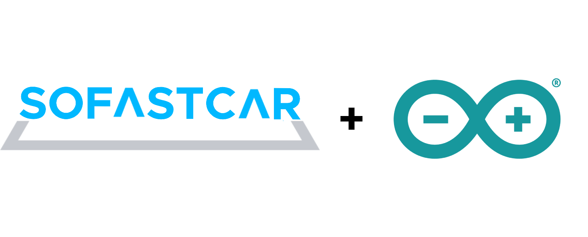

<p align="center">
  
</p>

# SOFASTCAR-Arduino
카셰어링 서비스를 제공하는 [SOCAR](https://www.socar.kr/)의 자동차를 담당하는 Arduino 프로젝트 입니다.

## Libraries
프로젝트내에서 사용한 라이브러리 목록 입니다.

- SoftwareSerial (시리얼 통신 관련)
- Servo (서보모터 관련)

## Use module
프로젝트에서 사용된 모듈의 정보 입니다.

- Arduino Uno R3 board
- Bluetooth 4.0 (HM-10)
- 3Color Led
- Piezo buzzer
- 360° servo moter

--- 

## Projcet
- [iOS-Arduino 연결 테스트](https://youtu.be/pgaeHQ56xD0)
- [SOFASTCAR-Arduino 연결 테스트](https://youtu.be/9i-E2824ebM)
- [SOFASTCAR-Arduino 서보모터 연결 테스트](https://youtu.be/KBSUovyQNUs)

### simulation

<p align="center" style="display: flex;justify-content: space-between;">
  
</P>

*✔시연영상은 [youtube](https://www.youtube.com/playlist?list=PLYwpgjpU9h1R89lwtWDitPj995Cl91eok)에서 확인하실 수 있습니다.*

### 회고
```
처음엔 가설로만 세웠던 아두이노 프로젝트를 진행하면서 여러가지 모듈을 구입해 쏘카의 물리적인 자동차를 구현하는 프로젝트를 진행해 보았다.
모듈을 각각 구매하였을때 아이폰과 블루투스 통신을 할때 클래식 블루투스 모듈인 HC-06모듈은 아이폰과의 연결이 제한되는것을 모르는 상태에서
구매를 진행 하였는데 다행이 구매한 모듈이 저전력 블루투스모듈인 BLE(HM-10)모듈이여서 원할하게 연결을 진행할 수 있었다.
하지만 서보모터를 구매할때에 360° 모듈을 구매하여 각도가 현 프로젝트 버전에서는 원하는 각도가 아닌 회전상태에서 딜레이를 주어 정지하는
방식으로 구현되어 180° 모델로 구매하여 각도를 원하는 각도로 조정하는 방법은 사용할 수 없다는것을 뒤늦게 알게되어 아쉬웠다.
프로젝트 기획때에 조금 더 자세히 알아보고 구매를 진행해야 더 완성도있는 프로젝트를 구현할 수 있다는것을 알게되었다.
```